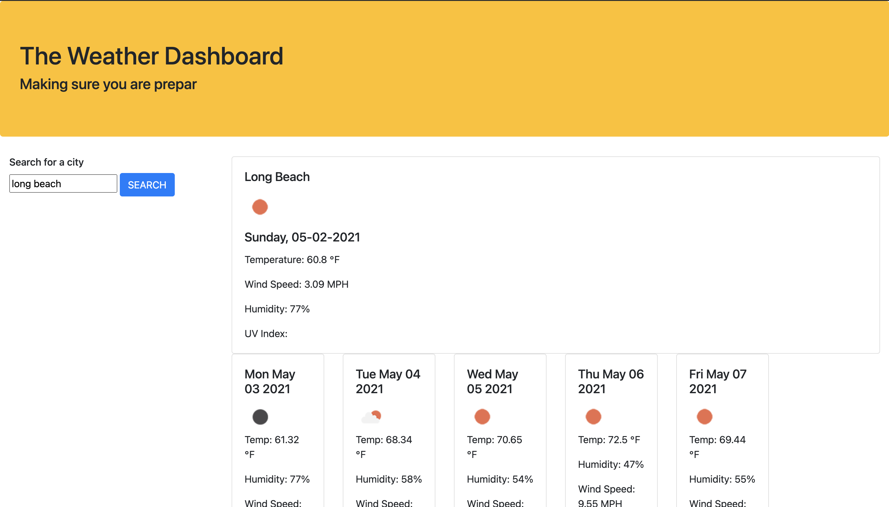

In this assignment I was challenged to create a weather Dashboard application. It was extremely challenging to get the application to show recent searches and to display the uv index. I will continue to work on this project in order to get those two sections to work properly. I learned how to better use jquery. I now understand why most developers prefer to use jquery instead of vaniall JS

[Link to deployed webpage](https://temifemi.github.io/weatherDashboard/)

## Screenshot of Portfolio Website
